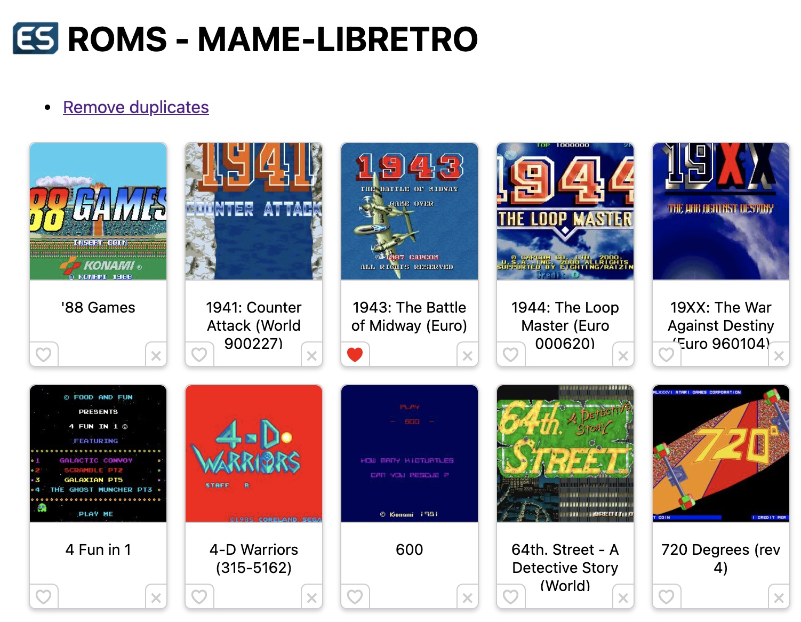

# Retropie Rom Browser

A simple PHP based webapp allowing to browse your installed ROMS and:
- Delete roms
- Add or remove roms from your favorite
- Remove duplicates from your roms collection

&nbsp;

&nbsp;

## Setup

Your mileage may vary there but you need to have a HTTP server with PHP enabled. Instructions can be found [here](https://pimylifeup.com/raspberry-pi-lighttpd/) (provided as an example without warranty). On my setup, [Pi-hole](https://pi-hole.net/) was also installed so lighttpd and PHP came for "free".

Now git clone this repo in `/var/www` directly.

Then you need to run the following commands:
```
ln -s $HOME/.emulationstation/downloaded_images /var/www/retropie_rom_browser/covers
find $HOME/.emulationstation/gamelists -name gamelist.xml -exec chmod o+w {} \;
```

The first command allows to view game covers in the browser. The second command allows to add roms as favorites.

Once done you should be able to access the URL: [http://\<raspeberry pi ip\>/retropie_rom_browser](http://127.0.0.1/retropie_rom_browser)

## Customization

If RetroPie/EmulationStation are not installed by `pi` user, you need to change the constants at the top of `romsite.php` file.

## Deduplication

Deduplication aims at removing duplicate roms for the same system (not across systems). It does by checking if multiple roms refer to the same game name and then uses a basic knowledge to determine which version to keep. Some examples of rules:
- Try to avoid bootleg and beta versions
- Use Revision/Set/... to try to keep latest version
- Choose versions from specific regions over others

The region prioritization is opiniated and you may want to change the score of each region in `romsite.php`. Try to keep a 20 point difference between each region to allow for revision numbers to have an impact.

Before roms are actually deleted, you will get a confirmation screen with a summary of the "decision" that was made for each game.

